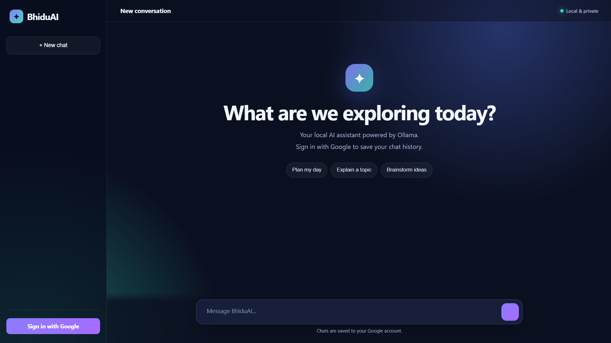

# BhiduAI

> A small experimental local AI project built with Python and PyTorch.

BhiduAI is a learning-focused AI project that implements a compact character-level decoder-only Transformer and trains it on a local text dataset. It also includes a Flask-based web interface that currently uses a locally running Ollama model for conversational responses.



## Overview

BhiduAI currently contains two related AI workflows:

1. **Custom TinyGPT** — a compact decoder-only Transformer implemented in PyTorch and trained from `datasets/train.txt`.
2. **Web Assistant** — a Flask application using a local Ollama model, Google authentication, and Firestore-backed chat history.

The project is experimental and educational. The custom model is intentionally small, and its responses may be incorrect.

## Architecture

```text
                         BhiduAI
                            |
              +-------------+-------------+
              |                           |
        Custom TinyGPT               Web Assistant
              |                           |
          PyTorch                      Flask
              |                           |
   Character-level training            Ollama
              |                           |
     datasets/train.txt             Google OAuth
              |                           |
   checkpoints/bhiduai.pth           Firestore
```

## Project Structure

```text
BhiduAI/
├── chatbot/
│   └── chat.py
├── checkpoints/
├── datasets/
│   └── train.txt
├── model/
│   └── model.py
├── tokenizer/
├── training/
│   └── train.py
├── app.py
├── .gitignore
└── README.md
```

## Custom TinyGPT

The custom model is a compact decoder-only Transformer called `TinyGPT`.

| Component | Configuration |
|---|---:|
| Context / block size | 64 |
| Embedding size | 64 |
| Attention heads | 4 |
| Transformer layers | 2 |
| Feed-forward expansion | 4× embedding size |
| Dropout | 0.1 |
| Activation | ReLU |
| Tokenization | Character-level |

The model uses causal self-attention so a position cannot attend to future positions.

## Training

Training is performed using `training/train.py`.

```text
Batch size:        16
Block size:        64
Training steps:    2000
Learning rate:     0.001
Optimizer:         AdamW
Gradient clipping: 1.0
Seed:              42
Device:            CUDA when available, otherwise CPU
```

Pipeline:

```text
datasets/train.txt
       ↓
Character vocabulary
       ↓
Character IDs
       ↓
64-token training sequences
       ↓
TinyGPT
       ↓
Cross-entropy loss
       ↓
AdamW optimization
       ↓
Model checkpoint
```

The trained checkpoint is written to `checkpoints/bhiduai.pth` and is excluded from Git.

Train with:

```powershell
python training/train.py
```

Optional arguments:

```powershell
python training/train.py --steps 5000 --batch-size 16
```

## Terminal Chatbot

`chatbot/chat.py` loads the trained checkpoint and runs the custom character-level model locally.

```powershell
python chatbot/chat.py
```

Commands:

```text
exit
/teach your training text here
/retrain
```

`/teach` appends new text to `datasets/train.txt`. `/retrain` trains a new checkpoint using the updated dataset.

This is **dataset-assisted retraining**, not instant learning from a conversation.

## Web Application

`app.py` contains the Flask web application.

Features include:

- Dark responsive chat interface
- Google sign-in
- Local Ollama inference
- Chat history loading
- New chat interface
- Suggested prompts
- Message length validation
- Error handling

Default Ollama model:

```text
llama3.2:3b
```

Default endpoint:

```text
http://127.0.0.1:11434/api/generate
```

Run Flask with:

```powershell
python app.py
```

The application listens locally on:

```text
http://127.0.0.1:5000
```

## Authentication and Chat History

Google OAuth is implemented using Authlib.

Authenticated chat history is stored in Google Cloud Firestore using the Google account's unique `sub` identifier.

The application loads up to the most recent 50 stored chat records.

```text
User
  ↓
Flask Web UI
  ↓
Google authentication
  ↓
Local Ollama model
  ↓
AI response
  ↓
Firestore chat history
```

The AI inference is local through Ollama, while authenticated chat history is stored in Google Cloud Firestore.

## Configuration

BhiduAI uses environment variables for sensitive configuration.

Example placeholders:

```text
SECRET_KEY=your-secret-key
GOOGLE_CLIENT_ID=your-google-client-id
GOOGLE_CLIENT_SECRET=your-google-client-secret
OLLAMA_URL=http://127.0.0.1:11434/api/generate
OLLAMA_MODEL=llama3.2:3b
LOG_LEVEL=INFO
```

**Never commit your real `.env` file, OAuth client secret, API keys, or other credentials to GitHub.**

## Dataset

The initial dataset is a small hand-written educational text corpus covering:

- BhiduAI's identity and purpose
- Python and C++
- Machine learning
- Neural networks
- Language models
- Training, loss, and optimization
- GPU computing
- Simple conversational phrases

## Limitations

The custom TinyGPT:

- Uses a small Transformer configuration.
- Uses character-level tokenization.
- Has a 64-token context window.
- Is trained on a small dataset.
- May generate incorrect or low-quality text.

The Flask web application currently uses Ollama rather than the custom TinyGPT checkpoint for its responses.

## Roadmap

- Expand and improve the training dataset
- Improve tokenizer and text representation
- Increase model capacity
- Improve training and evaluation
- Connect the custom model directly to the web application
- Improve conversation context
- Add richer chat features
- Continue improving the web interface
- Add more local AI tools and integrations

## Tech Stack

- **Python**
- **PyTorch**
- **Flask**
- **Ollama**
- **Authlib**
- **Google OAuth**
- **Google Cloud Firestore**

## Security

The repository excludes sensitive and generated files through `.gitignore`, including:

```text
.env
checkpoints/
*.pth
*.pt
*.ckpt
__pycache__/
virtual environments
```

Keep credentials and private configuration outside version control.

## Status

**Experimental / actively developing**

BhiduAI is a personal AI engineering and learning project focused on understanding model architecture, training, local inference, and AI application development.
